# Demo Walkthrough — Vista del Sol ES

The four-act demo script from `plans/mvp-implementation-plan.md` §2, written so a
non-author can run it cold. Every screenshot below was captured from the build this
document ships with. Total run time: ~8 minutes presented, ~3 minutes speedrun.

## Before you start

```bash
npm install     # once; Node 20.19+ or 22.12+
npm run dev     # → http://localhost:5173
```

- No network is used at runtime — verify in devtools if asked (Network tab stays empty
  after load; the KB and the synthetic project are bundled).
- **Reset between runs (the 10-minute reset path, in practice ~5 seconds):** top-right
  `⋯` menu → *Reset demo (clear storage, reload v1)* → confirm. You are back at the
  fresh load screen with all decisions cleared. (Equivalent manual path: devtools →
  clear localStorage → reload.)
- Decisions persist in localStorage; you can also `⋯ → Download decisions JSON` and
  re-load that file later — useful insurance before going on stage.

## Act 1 — Load (≈1 min)

> The pitch: *the dossier program already extracted the facts; watch every
> deterministic LAUSD decision resolve itself before the UI even appears.*

- [ ] Open the app. Vista del Sol ES is preloaded with its project facts
      (K-5, 350 students / 13 classrooms, LADWP, 88 psi street, all-electric).
      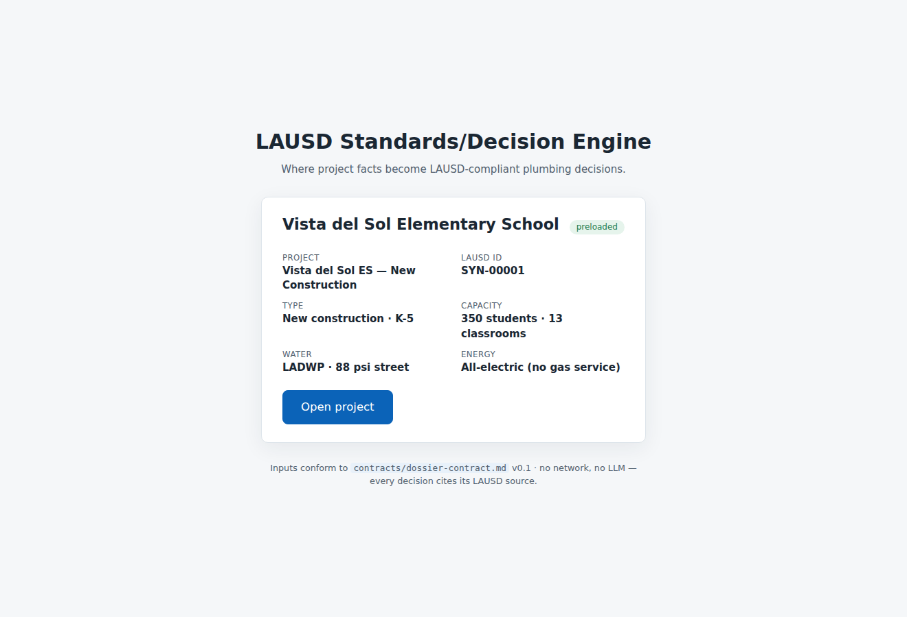
- [ ] Click **Open project**. The import animation validates the contracts and
      resolves all 43 rooms in under a second.
- [ ] Dashboard: **45 decisions auto-resolved**, **11 exception cards waiting**,
      53% completeness. Point out the gas-suppression diagnostic line (all-electric
      campus) and the per-building meters.
      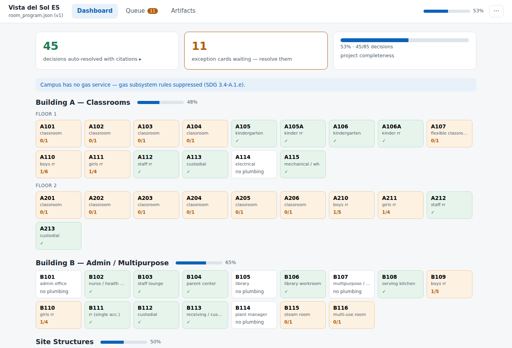
- [ ] Click the auto-resolved stat — every engine decision shows its one-line
      rationale and **citation chips** (click one: distilled text + doc § + version).
      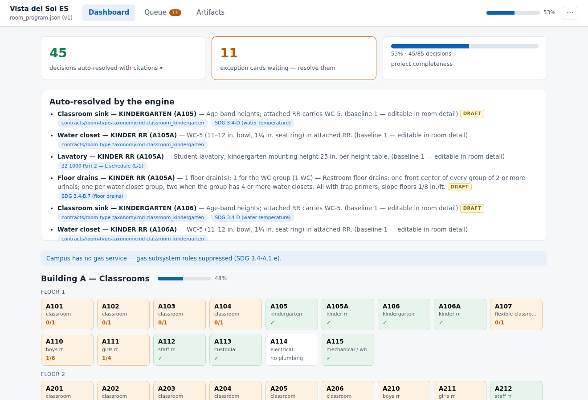
- [ ] Demo detail for the skeptics: open room **A114 (Electrical)** — the floor-drain
      rule was evaluated and **correctly did not fire** above grade, with the SDG
      3.4-B.7 citation. The engine shows its work even when the answer is "nothing".
      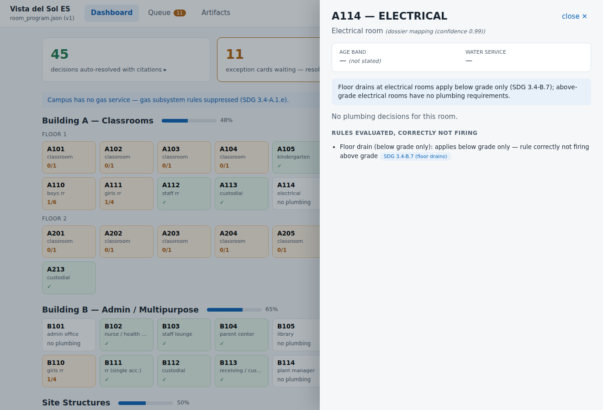

## Act 2 — The queue (≈3 min)

> The pitch: *the designer is here only for judgment calls — eleven cards, none needs
> more than a click or a number.*

Go to **Queue**. Cards arrive biggest-impact first; answer them in order:

- [ ] **1 · Classify "STEAM ROOM" (B115)** — the extractor refused to guess
      (steam room? STEAM lab?). Options are the full taxonomy, fuzzy-ranked.
      Click *show all*, pick **Makerspace**. Watch the card snap resolved — the room
      immediately fires its ST-3 sink with citations.
      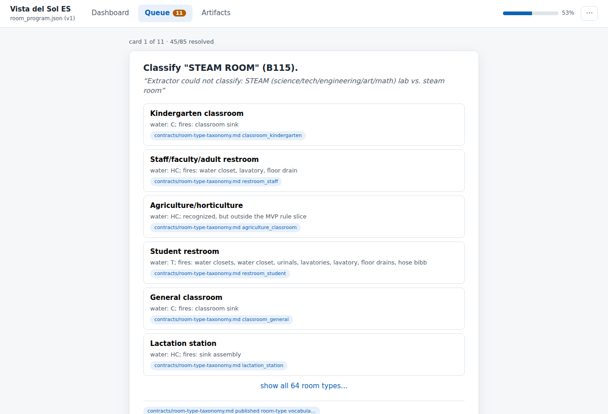
- [ ] **2 · Confirm "MULTI-USE ROOM" (B116)** — extractor confidence 60%, below the
      0.8 trust threshold. Confirm **Multipurpose room** (the suggested default).
- [ ] **3 · Age band for Boys RR A110** — the one restroom genuinely needing a human
      (serves the kindergarten wing *and* grades 1–2; WC model + mounting heights hang
      on it). Pick **Elementary** — the kinder kids have their own attached restrooms.
      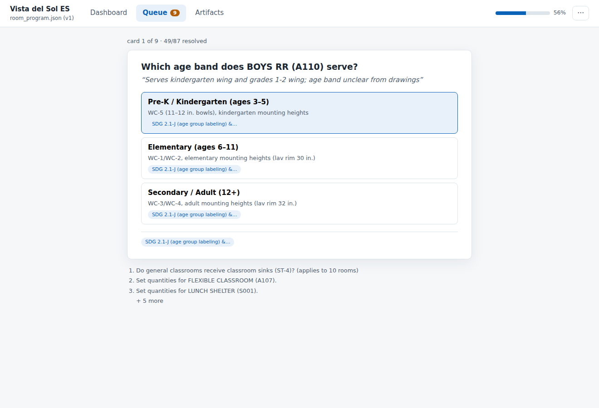
- [ ] **4 · "Do general classrooms receive classroom sinks?"** — ONE batch card for
      all 10 classrooms (the no-overwhelm principle made visible; expand *applies to
      10 rooms*). Answer **Yes** — ten rooms snap together at once.
      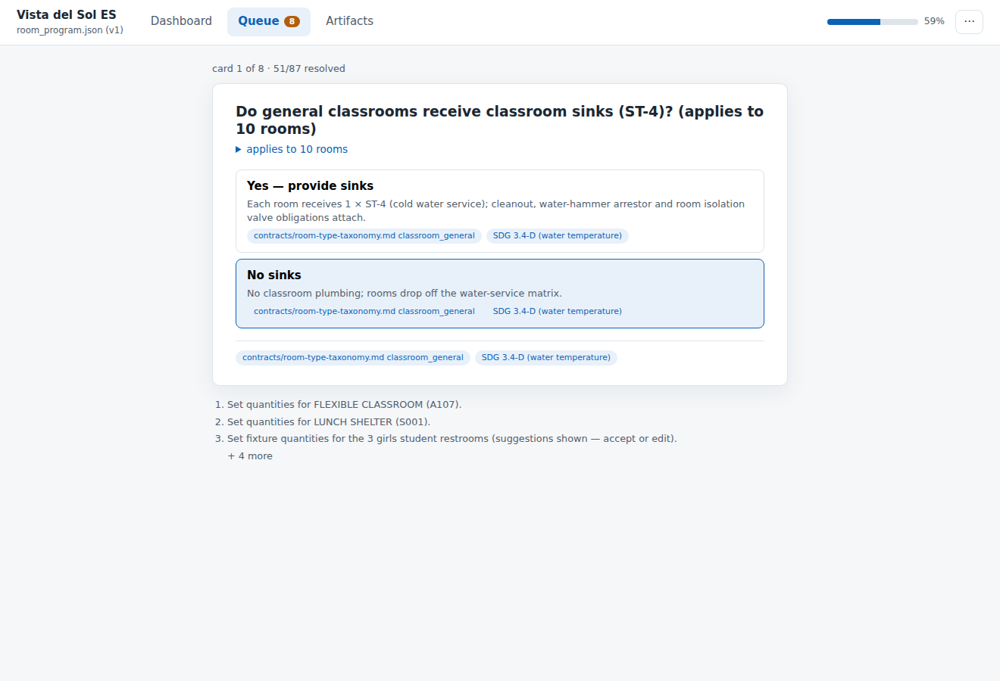
- [ ] **5 · Flexible classroom A107 sink count** — accept the suggested 1 × ST-2.
      *(Remember this one — Act 4 invalidates it.)*
- [ ] **6 · Lunch shelter drains** — layout-dependent judgment; type **2**, accept.
- [ ] **7 · Girls restrooms quantities** — one card for all 3 girls RRs. Suggestions
      show their basis ("campus required 7 (1:25 → 7, DRAFT CPC values) ÷ 3
      restrooms") with DRAFT badges — the CPC ratios are placeholders until verified
      (OPEN-QUESTIONS OQ-1), and the suggestion is editable, never a requirement.
      Accept.
      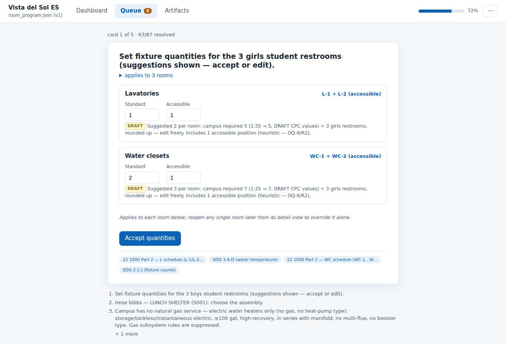
- [ ] **8 · Boys restrooms quantities** — edit urinals to **1 standard + 1
      accessible** (shows the designer overriding a heuristic), accept.
- [ ] **9 · Lunch shelter hose bibbs** — a choice card: HB-1 vs HB-2 follows wall
      construction (mapping unverified → designer chooses; OQ-13). Pick **HB-1**,
      quantity 2.
- [ ] **10–11 · Project acknowledgments** — all-electric water heating and LADWP
      Rule 16-D. One click each. (The PRV station at 88 psi never asked — it
      auto-resolved with the SDG 3.4-E.2 citation in Act 1.)
      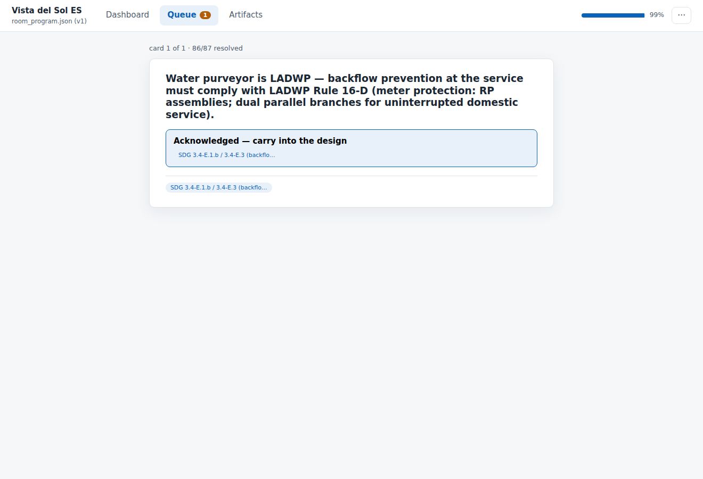
- [ ] Inbox zero: 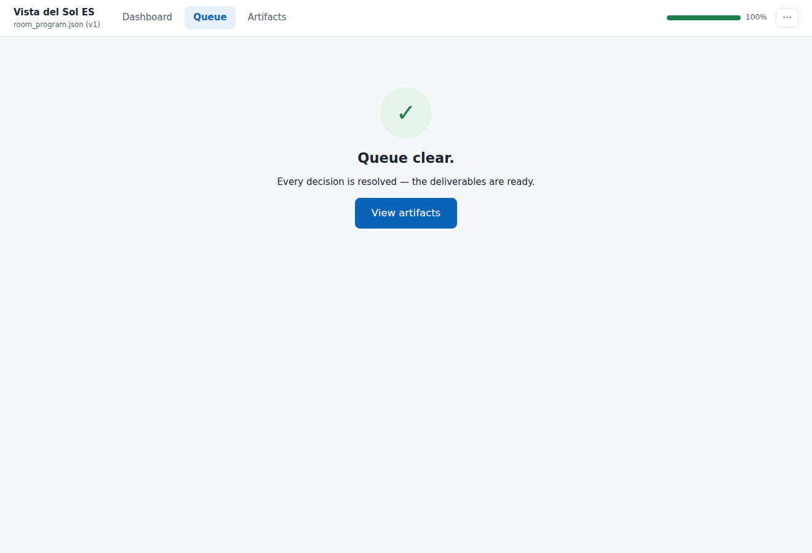

## Act 3 — The payoff (≈2 min)

> The pitch: *the three deliverables they hand-build today, generated as a side effect
> of answering eleven cards.*

- [ ] Completeness hits 100% (dashboard says **artifacts unlocked**).
      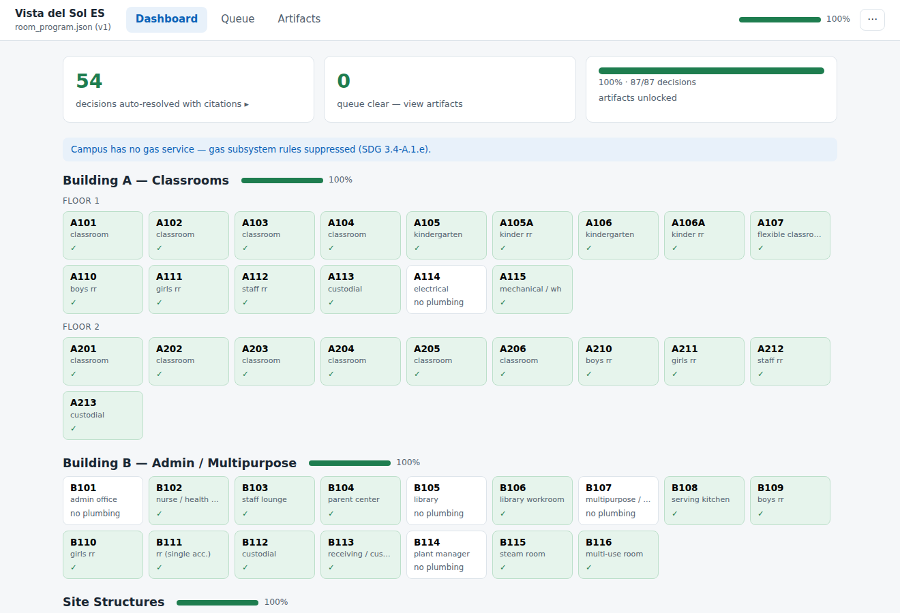
- [ ] **Fixture schedule** — designations grouped by family, schedule-ready
      descriptions, real manufacturers where verified (L-1: CECO / Kohler / Zurn;
      F-4: Chicago 3400-ABCP), mounting heights per age band (L-1 shows 25" preK-K /
      30" elem from 22 1000 2.46), counts, collapsed locations, component rows
      (FLV/F/PT/DFWF) indented, the LAUSD footer note block — each line cited. Hover
      any row: the rooms/decisions that produced it.
      
- [ ] **Fixture-to-occupant tabulation** (the mandatory plan deliverable, SDG
      2.1-J.1.h) — campus + per-building, occupancy basis 350 students / 26 staff
      (2 × 13 classrooms), required-vs-provided with ✓ status. The DRAFT banner stays
      until a human verifies the CPC ratios (risk R1) — we never show unbadged counts.
      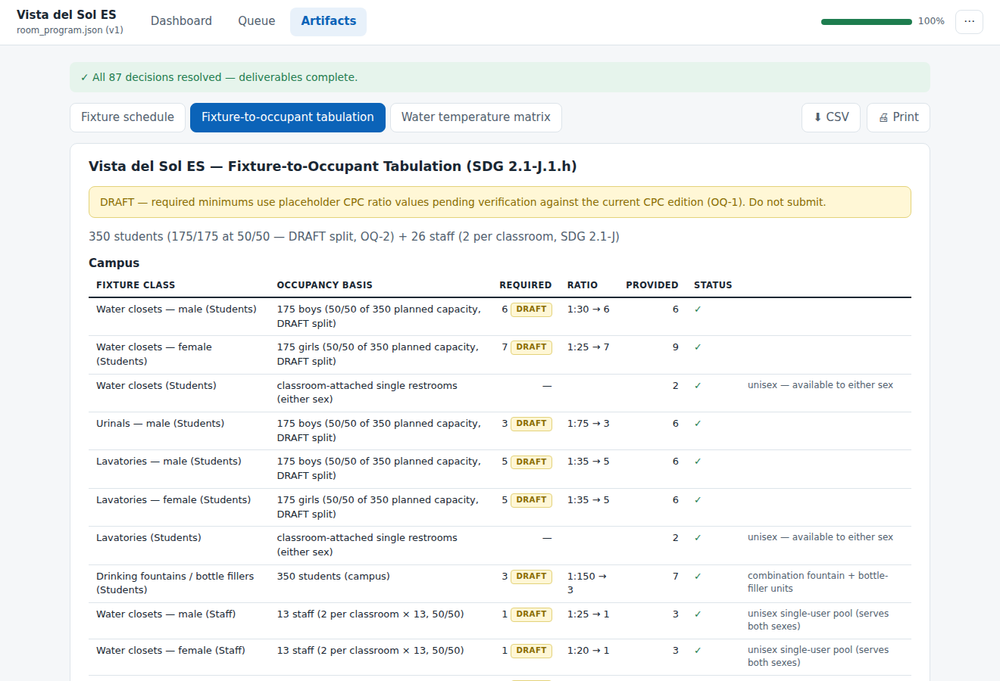
- [ ] **Water temperature matrix** — tempered at student RR lavatories (with the
      "TMV in custodial room, not in the restroom" note), hot+cold at staff/support
      rooms, cold at classroom sinks, **tepid** at the receiving-room emergency
      eyewash. Every row cites its SDG 3.4-D driver.
      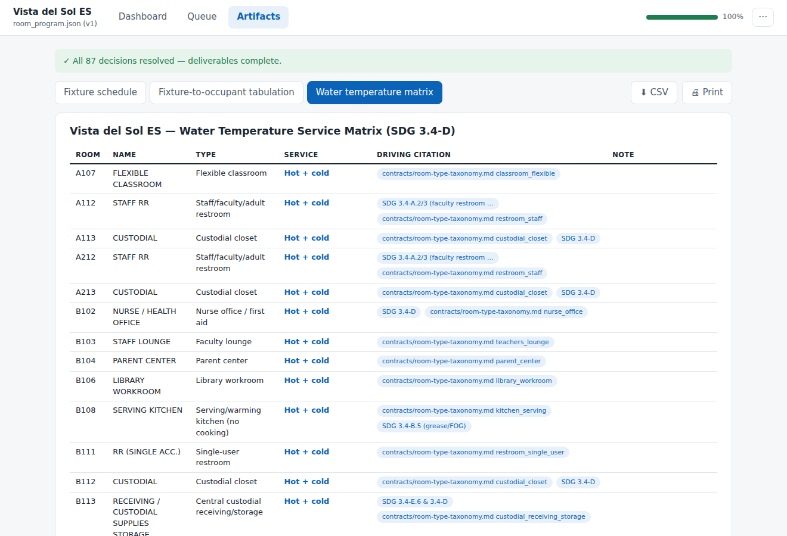
- [ ] Click **⬇ CSV** on any tab (opens cleanly in Excel/Sheets) and **🖨 Print**
      (print stylesheet strips the chrome): 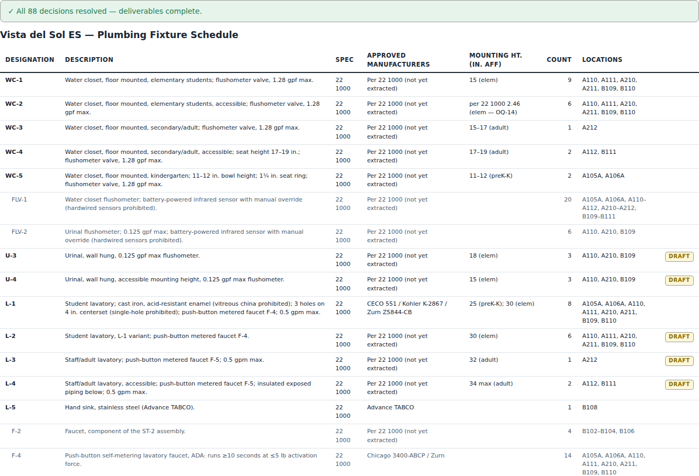
- [ ] Bonus traceability: open room **B107 (Multipurpose)** — it generates the
      building-level lobby fountain requirement (SDG 2.1-K.2.a).
      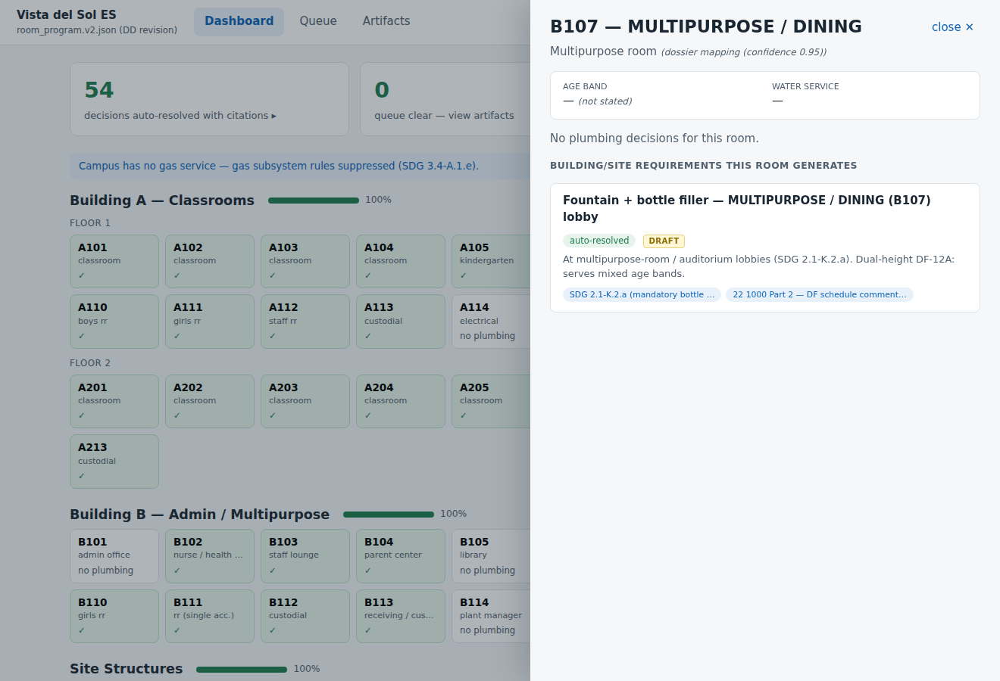

## Act 4 — The DD shuffle (≈2 min)

> The pitch: *the architect just moved your cheese. Watch nothing get lost.* This is
> the moment that wins working designers.

- [ ] `⋯` menu → **Import DD revision (room_program.v2.json)**. The diff preview
      appears BEFORE anything changes:
      **1 room changed** (A107 Flexible → Art Classroom, field-by-field),
      **1 added** (B117 Lactation Station), **0 removed**, **42 untouched** —
      *"32 of your decisions carry over untouched, 1 re-queued because facts changed
      underneath it, 1 new decision from added rooms."*
      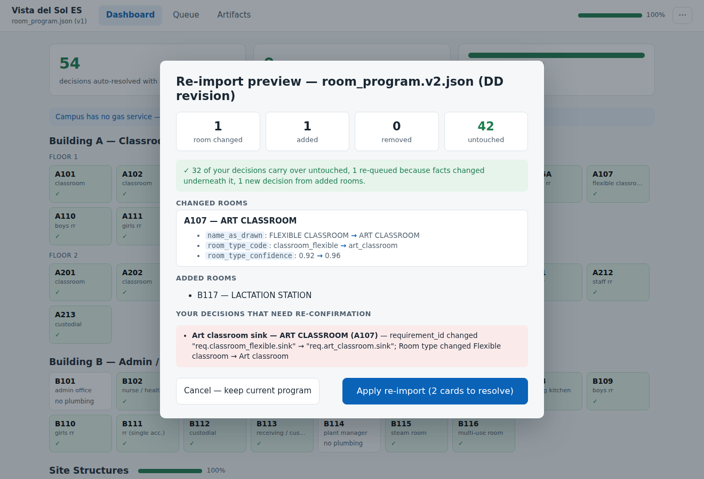
- [ ] Click **Apply re-import (2 cards to resolve)**. The queue opens with the
      **stale card first**: *"Room type changed Flexible classroom → Art classroom;
      your sink decision was based on the old facts"* — your previous answer shown,
      the new choice (ST-5 vs ST-6 art sinks) presented inline. Pick **ST-5**.
      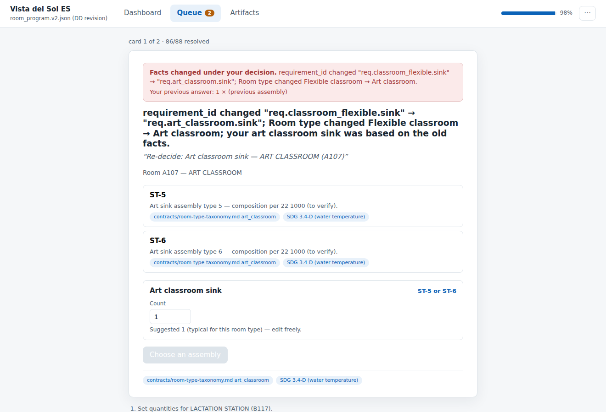
- [ ] The new room's card: B117 lactation station sink (ST-3, suggested 1). Accept.
      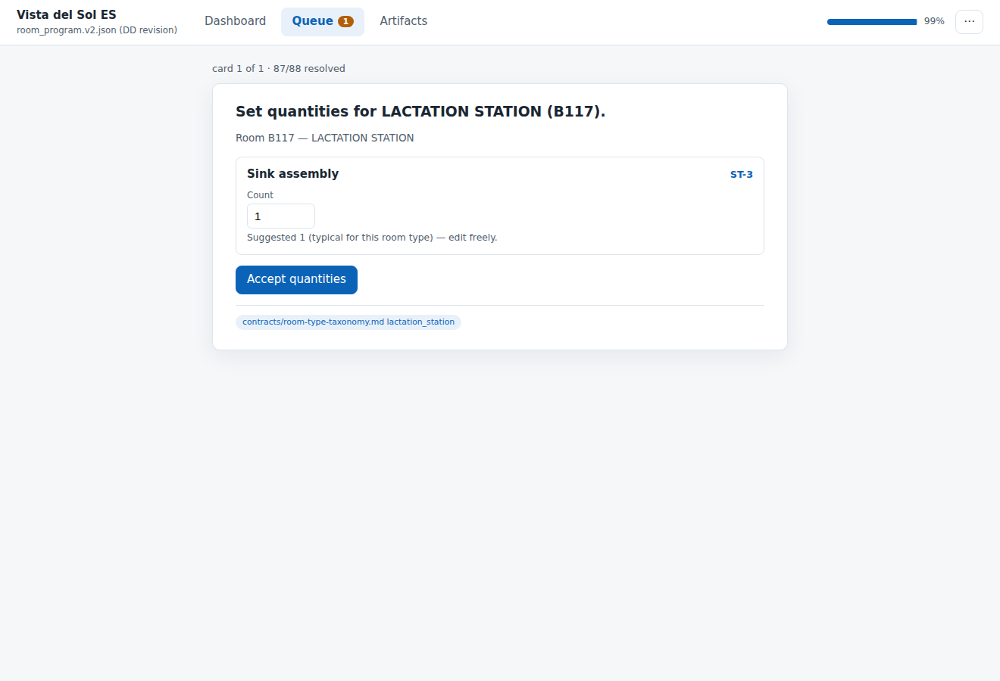
- [ ] Queue clear again; artifacts regenerated — the schedule now shows **ST-5** at
      A107 and **ST-3** at B117: 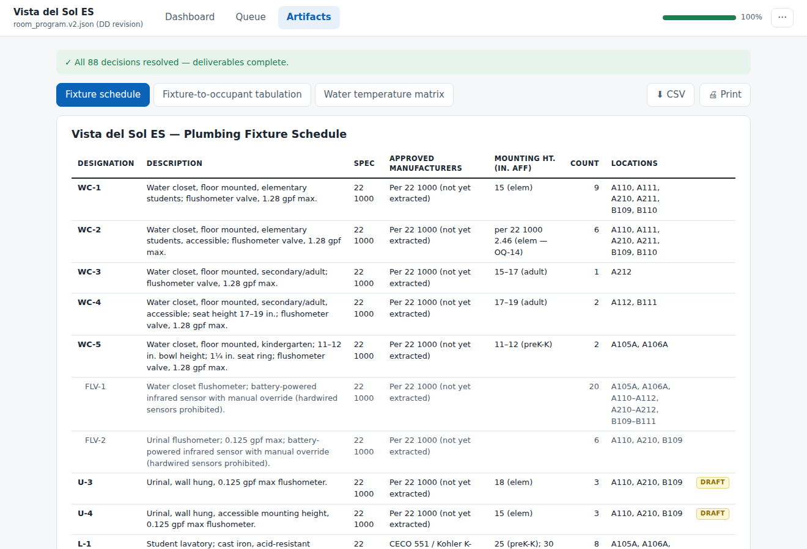
- [ ] Prove nothing was lost: open **B115** — your makerspace classification from
      Act 2 survived the re-import untouched.
      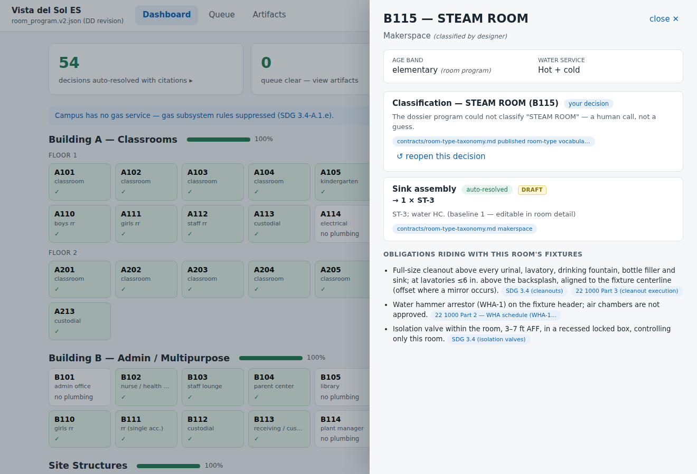

## Edge states worth knowing (if questions come up)

- **Partial artifacts**: open Artifacts before finishing the queue — pending decisions
  render as an explicit gap list ("pending decision …"), never silently missing rows.
- **Undo**: any human decision reopens from the room detail (`↺ reopen this
  decision`) — it re-queues just that room; batch answers fan out per room, so a
  single-room override never disturbs its siblings.
- **A110 ripple**: the floor-1 entry fountain stays "pending — awaiting age band"
  until card 3 is answered, then auto-selects child-height DF-12; floor drains derive
  from the answered WC/urinal counts (SDG 3.4-B.7 math shown in the rationale).
- **Draft discipline**: every DRAFT badge traces to an `OPEN-QUESTIONS.md` entry;
  the top one (OQ-1, CPC ratios) must be human-verified before this is shown as
  anything more than a demo.
- **Decisions file**: `⋯ → Download decisions JSON` before presenting; `Load decisions
  JSON…` restores it if anything goes sideways mid-demo.

## Numbers to have in your pocket

| Question | Answer |
|---|---|
| Rooms / decisions in v1 | 43 rooms → 85 decision points on load (45 auto-resolved), growing to 87 as the two classifications land and fire their rooms' rules |
| Cards in Act 2 | 11 (2 classify, 1 age band, 1 batch policy ×10 rooms, 4 quantity, 1 choice, 2 acks) |
| Fountain locations generated | 7 after Act 2 (3 RR entries, 2 lobbies, play yard, lunch shelter) |
| v2 delta | 1 changed / 1 added / 0 removed / 42 untouched · 1 stale + 1 new card |
| Draft KB records | 29 of 133, each linked to an OPEN-QUESTIONS entry |
